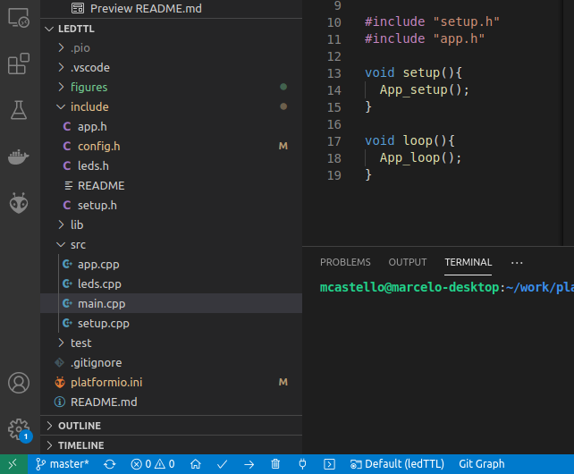

<h1>Catedra de Electrónica II</h1>
<h1>TP N°5 Módulo Oled</h1>
<h2>Indice</h2>

- [Introducción](#introducción)
- [Circuito](#circuito)
- [Procedimiento para la realización de este TP](#procedimiento-para-la-realización-de-este-tp)
  - [Clonar el repositorio](#clonar-el-repositorio)
    - [Para GNU/Linux (en PC del LCA)](#para-gnulinux-en-pc-del-lca)
    - [Para Windows (en PC del alumno)](#para-windows-en-pc-del-alumno)
  - [Cargar el proyecto](#cargar-el-proyecto)
  - [Compilar el proyecto](#compilar-el-proyecto)
  - [Grabar el microcontrolador](#grabar-el-microcontrolador)
- [Ejercicio propuesto](#ejercicio-propuesto)
- [Licencia](#licencia)


# Introducción
El presente proyecto es el quinto de una serie de trabajos prácticos de la asignatura Electrónica II del 4° año de la Carrera de Ingeniería Eléctrica. El proyecto implementa un microcontrolador ESP32 que incorpora un display oled que muestra tres variables que varían aleatoriamente.

# Circuito
En la figura se aprecia el circuito de este trabajo práctico, donde se observa que el led está en el pin físico 37 de la placa de desarrollo NODE-MCU32, que corresponde al puerto 23 (GPIO23) del microcontrolador.


# Procedimiento para la realización de este TP

Se deberán tener instaladas y configuradas las herramientas ya descriptas en las clases anteriores. Referirse al material suministrado para su concreción.

## Clonar el repositorio
Abrir una terminal, dirigirse a la carpeta donde se encuentran los proyectos de Electrónica II y luego  correr el comando de git para clonar el repositorio.
El comando de clonación tiene la siguiente sintaxis:

```sh
git clone <https://github.com/nombre_de_usuario_github/repositorio> [directorio de destino]
```
Ejemplo de comandos para clonar el repositorio:

### Para GNU/Linux (en PC del LCA)
```sh
cd /home/admlca/electronicaII/platformio
git clone https://github.com/mcastellogh/UTN_EII_ledTTL ledTT
```
### Para Windows (en PC del alumno)
```sh
cd C:\users\electronicaII\platformio
git clone https://github.com/mcastellogh/UTN_EII_ledTTL ledTT
```
## Cargar el proyecto
Ejecutar la aplicación Visual Studio Code con Platformio y abrir el directorio corresponediente al proyecto recién clonado (que debería ser ```ledTTL```):

```File-> Open folder-> <navegar hacia el directorio>-> Botón OK```

En la figura se aprecia esta acción.


Una vez abierto el directorio del proyecto, se verá en el panel de la izquierda el árbol de directorios y archivos, como muestra la figura.



## Compilar el proyecto

Pulsar el botón ```Build``` (tilde blanca en la barra de estado azul)


Finalizado el proceso se deberá mostrar el mensaje de compilación exitosa, [**<span style="color:#23cb84; bold">SUCCESS</span>**] como se muestra en la siguiente figura:


## Grabar el microcontrolador
- Insertar el conector USB de la placa de desarrollo en la PC. 
- Configurar el puerto USB. Para ello, seguir los pasos de [esta referencia](https://docs.platformio.org/en/latest/projectconf/sections/env/options/upload/upload_port.html).

- Pulsar el botón ```Upload```. Ver figura siguiente


Finalizado el proceso de grabación del microcontrolador, platformio lo reiniciará para que comience su ejecución.

Se deberá observar lo siguiente:
- el led azul de la placa de desarrollo destellará 10 veces con una frecuencia de aproximandamente 6.25 Hz, ya que el período de destello está fijado en 160 ms. Ver función ```welcome``` [app.cpp](https://github.com/mcastellogh/UTN_EII_ledTTL/blob/master/src/leds.cpp#L17-L26)
- El led externo (previamente soldado) destellará indefinidamente con una frecuencia aproximada de 2.5 Hz ya que la variable ```led_delay```está inicializada en 200 ms. Ver función ```blink_led``` [app.cpp](https://github.com/mcastellogh/UTN_EII_ledTTL/blob/master/src/leds.cpp#L28-L34)

# Ejercicio propuesto
Modificar el programa incorporando otra variable para poder hacer que los tiempos de encendido y apagado del led sean diferentes cambiando el valor de las dos variables correspondientes.


# Licencia
Este proyecto está licenciado bajo GPLV3.